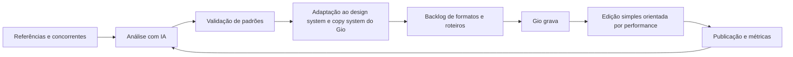
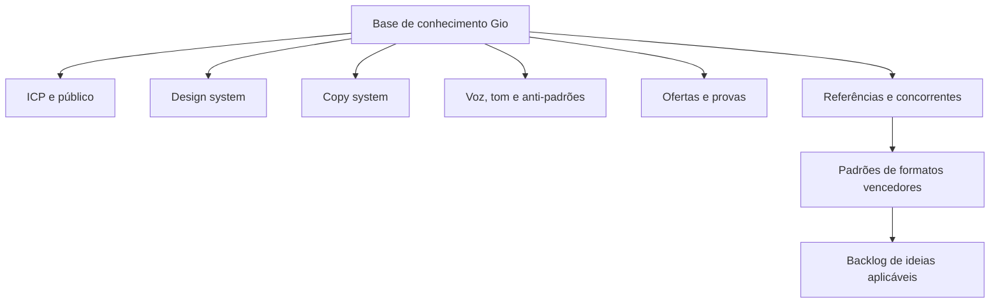
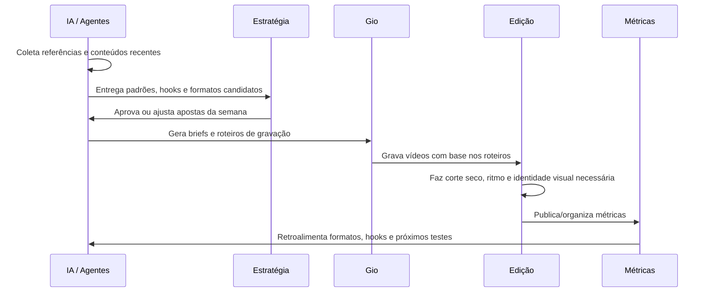
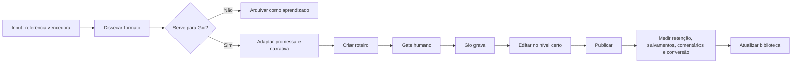
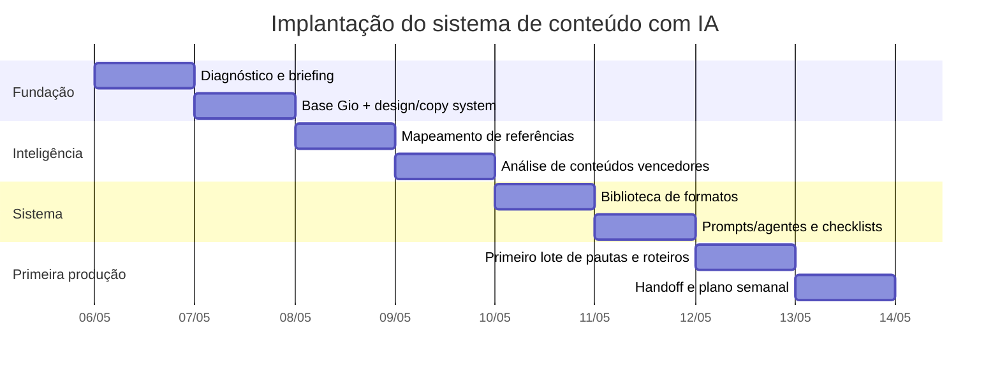

# Proposta visual — Fluxo de conteúdo orgânico com IA para Gio

> Documento criado a partir do briefing de 04/05/2026 e inspirado no pensamento de **content engineering**: antes de pedir que a IA crie peças, estruturamos contexto, inteligência, gates humanos e ciclos de aprendizado.

## 1. Resumo executivo

O pedido não é “editar melhor”. O pedido é construir um **sistema operacional de conteúdo orgânico** que encontre formatos vencedores, traduza esses formatos para o universo do Gio, gere roteiros e briefs executáveis, acompanhe gravação, edite com simplicidade quando isso performar melhor e aprenda com os resultados.

A lógica central será:



## 2. O que será entregue

### 2.1. Sistema de inteligência de conteúdo

Um repositório organizado de informações para a IA trabalhar com contexto consistente:



Arquivos sugeridos para operar o sistema:

| Arquivo | Função |
| --- | --- |
| `gio-knowledge-base.md` | Fonte central com posicionamento, público, oferta, estilo e restrições. |
| `design-system.md` | Cores, tipografia, identidade visual, padrões de thumbnail/legenda/tela. |
| `copy-system.md` | Hooks, CTAs, argumentos, linguagem, termos proibidos e estrutura narrativa. |
| `referencias.md` | Lista de perfis, concorrentes e creators monitorados. |
| `formatos-validados.md` | Biblioteca dos formatos que mais performam, com anatomia e critérios. |
| `roteiros.md` | Roteiros e pautas prontos para gravação. |
| `aprendizados.md` | Registro do que funcionou, o que não funcionou e ajustes de prompt/processo. |

### 2.2. Fluxo operacional semanal



## 3. Estimativa de tempo de execução com IA

A estimativa abaixo considera uma primeira implantação enxuta, com IA acelerando pesquisa, análise, estruturação e geração de briefs. O trabalho humano fica concentrado em julgamento estratégico, aprovação e acabamento.

### 3.1. Implantação inicial do sistema

| Etapa | Entrega | Tempo estimado |
| --- | --- | ---: |
| Diagnóstico e organização do briefing | Separar objetivos, referências, restrições, oferta e critérios de sucesso. | 1h |
| Construção da base Gio | Documentar design system, copy system, tom, oferta, público e anti-padrões. | 3h |
| Mapeamento das referências | Organizar perfis/concorrentes e critérios de análise. | 1h30 |
| Análise de conteúdos vencedores | Identificar formatos, hooks, duração, estrutura, edição e promessa. | 3h |
| Criação da biblioteca de formatos | Transformar padrões em templates replicáveis para Gio. | 2h |
| Criação do fluxo de prompts/agentes | Montar prompts para pesquisa, validação, roteirização, checklist e revisão. | 3h |
| Produção do primeiro lote de pautas | Gerar 10 a 15 ideias com roteiros/briefs de gravação. | 3h |
| Checklist de gravação e edição | Criar padrão para Gio gravar e para edição executar sem reinventar. | 1h30 |
| Revisão final e handoff | Organizar documentação, prioridades e próximos passos. | 2h |

**Total estimado da implantação:** **20h**.

### 3.2. Execução recorrente semanal

| Atividade semanal | Entrega | Tempo estimado |
| --- | --- | ---: |
| Monitorar referências | Lista dos conteúdos relevantes da semana. | 1h |
| Analisar padrões com IA | Resumo dos formatos, hooks, ângulos e hipóteses. | 1h30 |
| Selecionar apostas | Escolha humana dos formatos com maior chance de resultado. | 45min |
| Gerar roteiros e briefs | 5 a 8 roteiros prontos para gravação. | 1h30 |
| Ajustar ao Gio | Refinar linguagem, exemplos, promessa e CTA. | 1h |
| Revisar materiais gravados | Verificar aderência aos roteiros e selecionar melhores takes. | 1h |
| Orientar edição | Brief de corte seco, ritmo, legendas, telas e referências. | 1h |
| Ler métricas e atualizar aprendizados | Ajustar biblioteca de formatos e próximos testes. | 1h |

**Total recorrente estimado:** **8h45 por semana**, sem contar o tempo de gravação do Gio nem o tempo operacional de edição de cada vídeo.

## 4. Modelo de pipeline por peça de conteúdo



## 5. Critérios para validar se um formato deve ser executado

| Critério | Pergunta de validação | Peso |
| --- | --- | ---: |
| Aderência ao público | O tema conversa com a dor ou desejo real da audiência do Gio? | 25% |
| Prova de demanda | O formato já performou em referências ou concorrentes? | 20% |
| Facilidade de execução | Gio consegue gravar com naturalidade e baixo atrito? | 15% |
| Potencial de diferenciação | A aplicação fica específica do Gio ou genérica demais? | 20% |
| Clareza de promessa | O hook comunica ganho, tensão ou curiosidade em até 3 segundos? | 10% |
| Reaproveitamento | A ideia vira cortes, carrossel, stories ou sequência? | 10% |

Só entra em produção o formato que passa pelo filtro de **demanda + aderência + especificidade**.

## 6. Exemplo de saída que a IA deve gerar

```markdown
## Formato detectado
Storytelling de contraste: “o que eu fazia antes vs. o que faço agora”.

## Por que funcionou na referência
- Hook com tensão imediata.
- Corte seco e fala direta.
- Baixa produção, alta percepção de autenticidade.
- Entrega uma mudança prática, não uma opinião genérica.

## Aplicação para Gio
Tema: “O erro que fazia meus conteúdos parecerem bonitos, mas não venderem”.

## Roteiro curto
1. Hook: “Eu parei de tentar deixar o conteúdo bonito quando percebi isso.”
2. Contexto: antes eu priorizava acabamento e esquecia a intenção do conteúdo.
3. Virada: conteúdo bom precisa de promessa, tensão e prova.
4. Aplicação: hoje eu começo pelo comportamento que quero gerar.
5. CTA: “Se quiser, eu mostro o checklist que uso antes de gravar.”

## Direção de edição
- Corte seco.
- Legenda dinâmica apenas em frases-chave.
- Sem excesso de motion.
- Zoom leve no hook e na virada.
```

## 7. Como a IA entra no processo

| Papel da IA | O que ela faz | O que o humano decide |
| --- | --- | --- |
| Pesquisadora | Lê referências, conteúdos e padrões de mercado. | Quais referências são estratégicas. |
| Analista | Extrai hook, estrutura, promessa, edição, CTA e comentários. | Se o padrão é relevante para Gio. |
| Estrategista | Sugere ângulos e aplicações para a marca. | Prioridade e risco de cada aposta. |
| Roteirista | Cria scripts, variações de hooks e direção de gravação. | Aprovação final do conteúdo. |
| Editora assistente | Define checklist de ritmo, legenda, corte e referências. | O nível de edição adequado ao objetivo. |
| Learning loop | Compara métricas e atualiza aprendizados. | O que vira regra do sistema. |

## 8. Gates humanos obrigatórios

O sistema não deve virar uma esteira automática sem critério. Os pontos de aprovação são:

1. **Gate de referência:** confirmar se o concorrente ou creator analisado realmente faz sentido.
2. **Gate de formato:** aprovar se o formato combina com Gio.
3. **Gate de roteiro:** ajustar linguagem para não soar genérica ou artificial.
4. **Gate de gravação:** confirmar se o vídeo gravado tem energia e clareza.
5. **Gate de publicação:** validar se a peça respeita promessa, identidade e objetivo.
6. **Gate de aprendizado:** decidir o que entra na biblioteca como regra, hipótese ou descarte.

## 9. Cronograma sugerido



**Prazo recomendado:** 8 dias úteis para implantar com qualidade, revisar e entregar o primeiro lote pronto para gravação.

## 10. Métricas de sucesso

| Camada | Métricas |
| --- | --- |
| Criativo | Retenção nos 3 primeiros segundos, retenção média, taxa de conclusão. |
| Engajamento | Comentários qualificados, salvamentos, compartilhamentos, DMs. |
| Aprendizado | Formatos vencedores identificados, hooks reutilizáveis, padrões descartados. |
| Conversão | Cliques, leads, reuniões, respostas a CTA, vendas atribuídas quando possível. |
| Operação | Tempo por pauta, tempo por roteiro, taxa de aprovação, retrabalho de edição. |

## 11. Entrega final esperada

Ao final da implantação, a entrega será um sistema que permite responder semanalmente:

- Quais formatos estão funcionando nas referências?
- Quais desses formatos fazem sentido para Gio?
- Como transformar cada formato em roteiro gravável?
- Qual nível de edição é necessário para aquele conteúdo performar?
- O que as métricas ensinaram para a próxima rodada?

A entrega deixa de ser “vídeos editados” e passa a ser um **motor de conteúdo orgânico orientado por inteligência, execução simples e aprendizado contínuo**.

## 12. Referência estudada

Este documento usa como inspiração o artigo “Content Engineering: How to Build Your Content System in Claude Code”, publicado em 01/05/2026 pela GTM Strategist. A principal ideia incorporada é a de estruturar uma fundação de conhecimento, usar contexto modular, manter gates humanos e criar loops de melhoria para que a IA gere conteúdo específico, útil e difícil de copiar.
